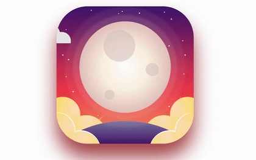

# Trying Something new: Animation using PUG

As web designers or web developers, we likely have to write fair share of **HTML**. It is not the most difficult task, but it can often feel a little boring or repetitive. **HTML** is static and thus displaying dynamic data for example fetched from API, we may end up with mishmash of **HTML** strings inside **JavaScript** and this can really become a nightmare to debug and maintain.

This is where **PUG** comes into the picture. **PUG** is a template engine for Node and for browser. It compiles to **HTML** and has an extremely easy syntax which can help make a code more readable. **PUG** helps to write reusable **HTML** and also pull data from database or API.

## Installing PUG

Make sure you have Node and NPM installed on your system. Below is the table of version of both that I have used.

| NODE  | NPM |
| ----- | --- |
|12.18.2 |6.14.5|

Install **PUG** on your system using given command: 

```
npm i -g pug-cli
```

Download Git Repository on your system: 
```
git clone https://github.com/charmilgandhi/Moon-Animation-Using-PUG.git
```

The screen looks like this: 


